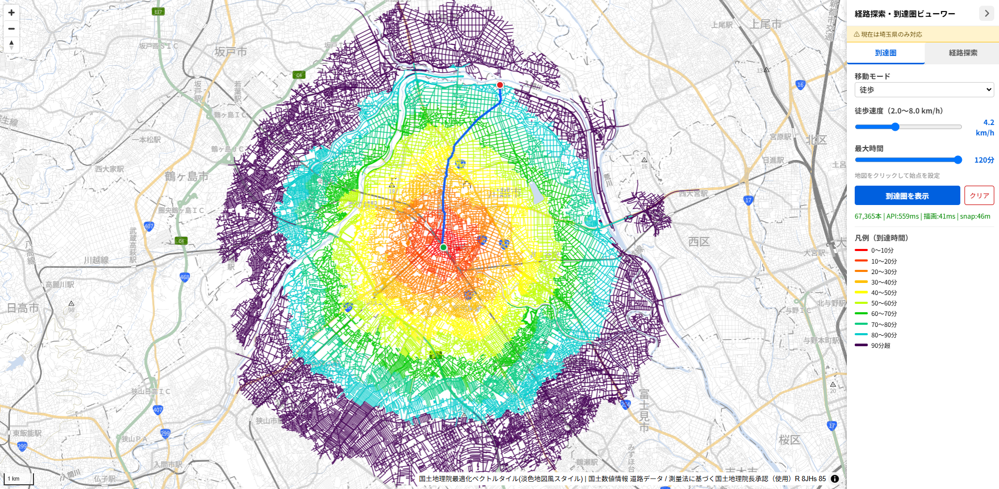

# 01. 到達圏分析・経路探索

## 概要

指定地点から N 分以内の到達範囲と最短経路を、車・徒歩モードで Web 上にインタラクティブ表示する。

## 利用データ

- 国土数値情報 道路データ（N13）

詳細は [`../../data/`](../../data/) を参照。

## 手法

[道路ネットワーク変換](../../common/road-network/)で生成したノード・リンク上で、ダイクストラ法により最短経路と到達圏を算出。

## 結果

指定地点から N 分以内の到達範囲と最短経路を、車・徒歩モードで Web 上にインタラクティブ表示。

## デモ

- https://shiwaku.github.io/ksj-route-search-api/

> 注: 公開デモの対象範囲は**埼玉県のみ**です（手法自体は全国の道路データに適用可能）。

## 図表

到達圏分析・経路探索デモのスクリーンショット（公開デモは埼玉県のみ対応）。
